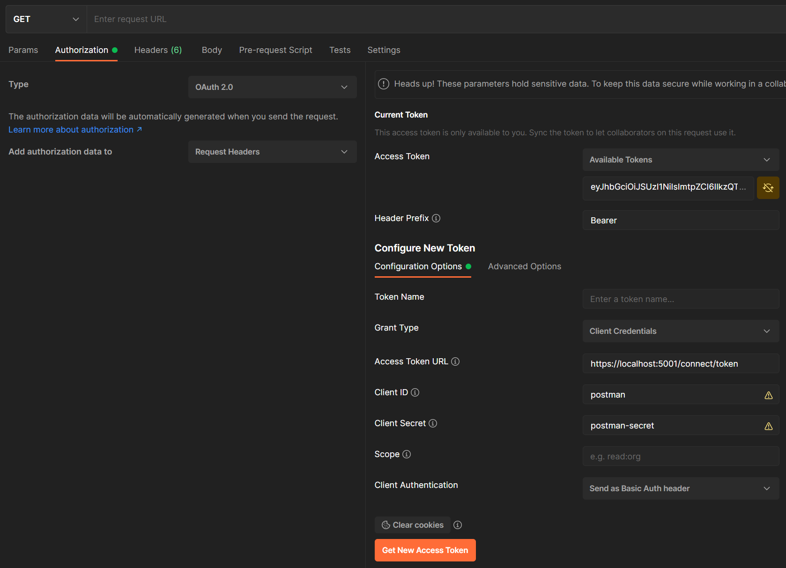
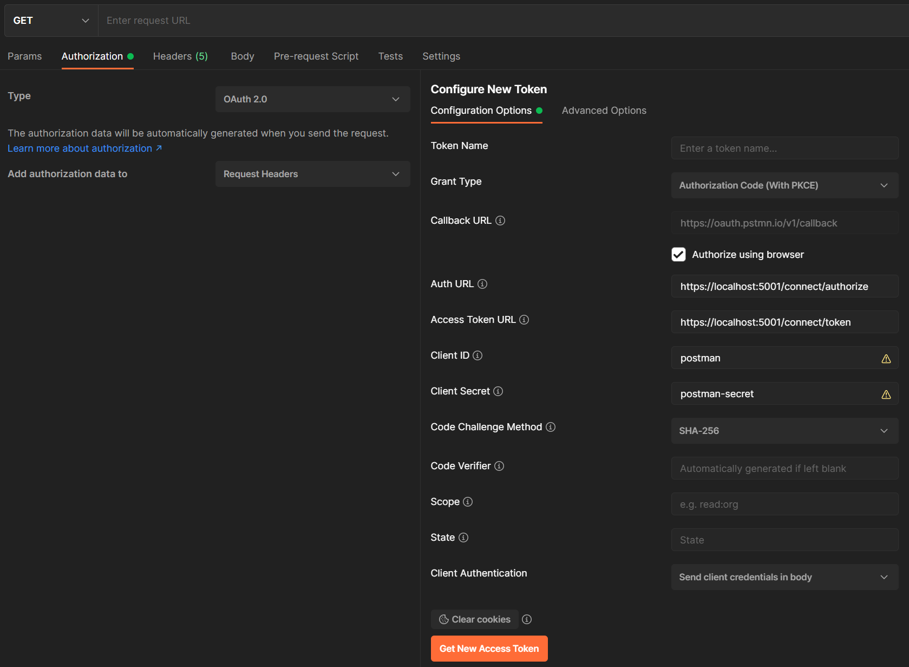
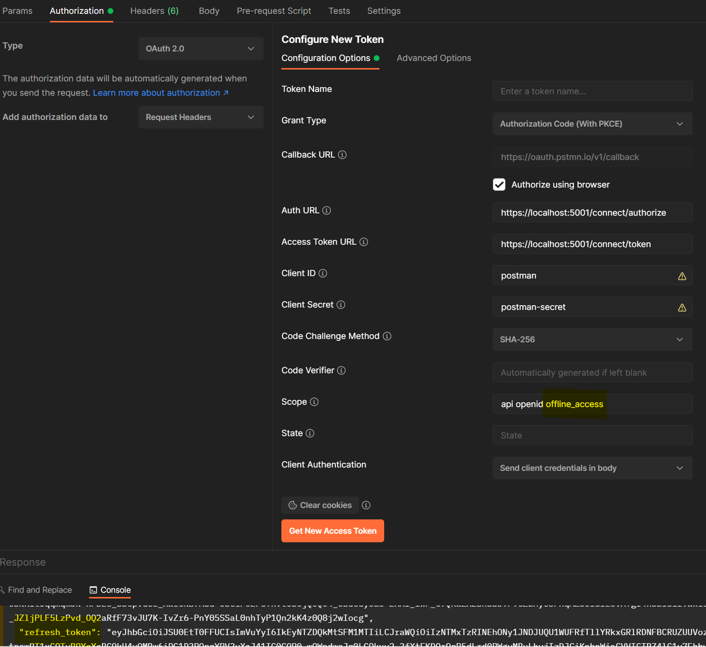
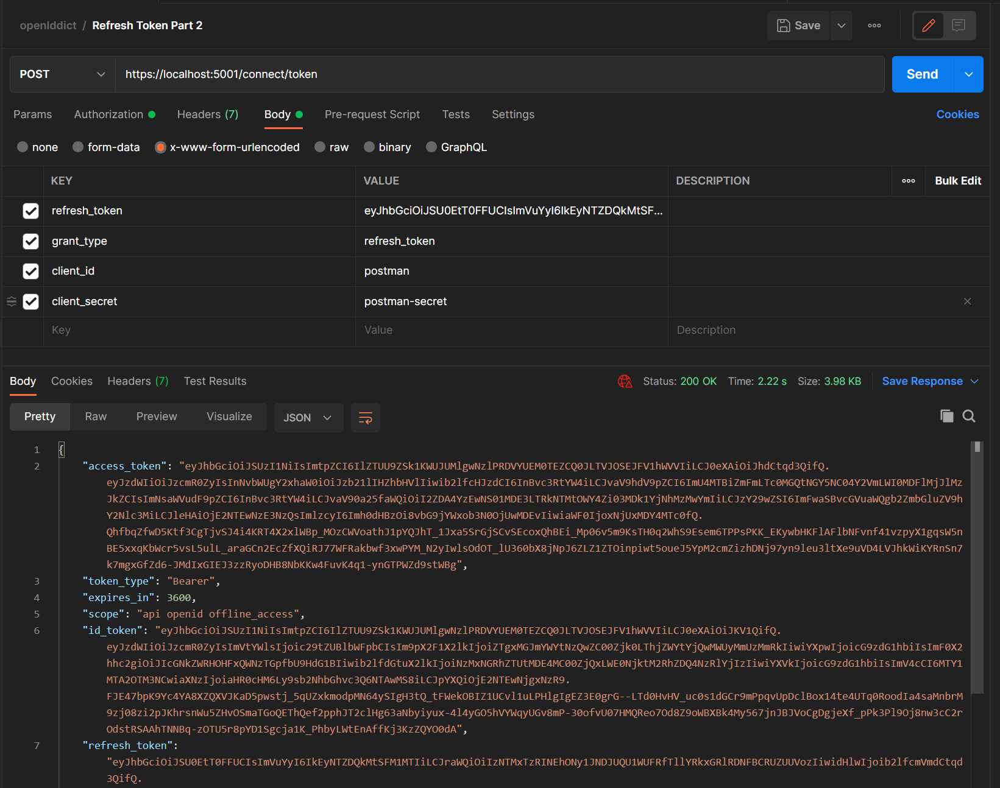

# Setting up an Authorization Server with OpenIddict

Source: <https://dev.to/robinvanderknaap/setting-up-an-authorization-server-with-openiddict-part-i-introduction-4jid>

## Part I: Introduction

Part 1: <https://dev.to/robinvanderknaap/setting-up-an-authorization-server-with-openiddict-part-i-introduction-4jid>

## Part II: Create ASPNET project

Part 2: <https://dev.to/robinvanderknaap/setting-up-an-authorization-server-with-openiddict-part-ii-create-aspnet-project-4949>

### Setup MVC

<https://dev.to/robinvanderknaap/setting-up-an-authorization-server-with-openiddict-part-ii-create-aspnet-project-4949>
```
dotnet new web --name AuthorizationServer
```
```
dotnet dev-certs https --trust
```

### Add Cookie Authentication

Use cookie authentication without ASP.NET Core Identity:
<https://docs.microsoft.com/en-us/aspnet/core/security/authentication/cookie?view=aspnetcore-6.0>

Login/Logout buttons are working now.

## Part III: Client Credentials Flow

Part 3: <https://dev.to/robinvanderknaap/setting-up-an-authorization-server-with-openiddict-part-iii-client-credentials-flow-55lp>

```
dotnet add package OpenIddict
dotnet add package OpenIddict.AspNetCore
dotnet add package OpenIddict.EntityFrameworkCore
dotnet add package Microsoft.EntityFrameworkCore.InMemory
```


```cs
builder.Services.AddDbContext<DbContext>(options =>
{
    // Configure the context to use an in-memory store.
    options.UseInMemoryDatabase(nameof(DbContext));

    // Register the entity sets needed by OpenIddict.
    options.UseOpenIddict();
});

builder.Services.AddOpenIddict()

    // Register the OpenIddict core components.
    .AddCore(options =>
    {
        // Configure OpenIddict to use the EF Core stores/models.
        options
            .UseEntityFrameworkCore()
            .UseDbContext<DbContext>();
    })

    // Register the OpenIddict server components.
    .AddServer(options =>
    {
        options.AllowClientCredentialsFlow();

        options.SetTokenEndpointUris("/connect/token");

        // Encryption and signing of tokens (DEVELOPMENT ONLY!)
        options
            .AddEphemeralEncryptionKey()
            .AddEphemeralSigningKey();

        // Register scopes (permissions)
        options.RegisterScopes("api");

        // Register the ASP.NET Core host and configure the ASP.NET Core-specific options.
        options
            .UseAspNetCore()
            .EnableTokenEndpointPassthrough();
    });
```

Check implementation: https://localhost:5001/.well-known/openid-configuration

Request-Headers according <https://datatracker.ietf.org/doc/html/rfc6749#section-4.1.3>

Get access token, using Authentication tab in Postman:
<https://learning.postman.com/docs/sending-requests/authorization/#oauth-20>



Manually Post in Postman to get Access Token:

```bash
curl --location --request POST 'https://localhost:5001/connect/token' \
--header 'Content-Type: application/x-www-form-urlencoded' \
--data-urlencode 'grant_type=client_credentials' \
--data-urlencode 'client_id=postman' \
--data-urlencode 'client_secret=postman-secret'
```

Result:

```json
{
  "access_token": "eyJhbGciOiJSU0EtT0FF...",
  "token_type": "Bearer",
  "expires_in": 3599
}
```

Disable token encryption

```cs
options
    .AddEphemeralEncryptionKey()
    .AddEphemeralSigningKey()
    .DisableAccessTokenEncryption(); // disable token encryption
```

Check token in <https://jwt.io/>

## Part IV: Authorization Code Flow

Part 4: <https://dev.to/robinvanderknaap/setting-up-an-authorization-server-with-openiddict-part-iv-authorization-code-flow-3eh8>

### Add Config

```cs
options
    .AllowAuthorizationCodeFlow()
    .RequireProofKeyForCodeExchange();

options
    ...
    .SetAuthorizationEndpointUris("/connect/authorize");

options
    ...
    .EnableAuthorizationEndpointPassthrough(); 
```

### Add Authorize endpoint

```cs
[HttpGet("~/connect/authorize")]
[HttpPost("~/connect/authorize")]
[IgnoreAntiforgeryToken]
public async Task<IActionResult> Authorize()
{
    var request = HttpContext.GetOpenIddictServerRequest() ??
        throw new InvalidOperationException("The OpenID Connect request cannot be retrieved.");

    // Retrieve the user principal stored in the authentication cookie.
    var result = await HttpContext.AuthenticateAsync(CookieAuthenticationDefaults.AuthenticationScheme);

    // If the user principal can't be extracted, redirect the user to the login page.
    if (!result.Succeeded)
    {
        return Challenge(
            authenticationSchemes: CookieAuthenticationDefaults.AuthenticationScheme,
            properties: new AuthenticationProperties
            {
                RedirectUri = Request.PathBase + Request.Path + QueryString.Create(
                    Request.HasFormContentType ? Request.Form.ToList() : Request.Query.ToList())
            });
    }

    // Create a new claims principal
    var claims = new List<Claim>
    {
        // 'subject' claim which is required
        new Claim(OpenIddictConstants.Claims.Subject, result?.Principal?.Identity?.Name ?? "n/a"),
        new Claim("some claim", "some value").SetDestinations(OpenIddictConstants.Destinations.AccessToken)
    };

    var claimsIdentity = new ClaimsIdentity(claims, OpenIddictServerAspNetCoreDefaults.AuthenticationScheme);

    var claimsPrincipal = new ClaimsPrincipal(claimsIdentity);

    // Set requested scopes (this is not done automatically)
    claimsPrincipal.SetScopes(request.GetScopes());

    // Signing in with the OpenIddict authentiction scheme trigger OpenIddict to issue a code (which can be exchanged for an access token)
    return SignIn(claimsPrincipal, OpenIddictServerAspNetCoreDefaults.AuthenticationScheme);
}
```

### Extend Authorization endpoint

```cs
[HttpPost("~/connect/token"), Produces("application/json")]
public async Task<IActionResult> Exchange()
{
    ...
    else if (request.IsAuthorizationCodeGrantType())
    {
        // Retrieve the claims principal stored in the authorization code
        claimsPrincipal = (await HttpContext.AuthenticateAsync(OpenIddictServerAspNetCoreDefaults.AuthenticationScheme)).Principal;
    }
    ...
}
```

Get Access token in Postman, using PKCE:



Error:

```
error:invalid_request
error_description:The specified 'redirect_uri' is not valid for this client application.
error_uri:https://documentation.openiddict.com/errors/ID2043
```

Add redirect URI:

```cs
RedirectUris = { new Uri("https://oauth.pstmn.io/v1/callback") },
```

## Part V: OpenID Connect

Part 5: <https://dev.to/robinvanderknaap/setting-up-an-authorization-server-with-openiddict-part-v-openid-connect-a8j>

Add OIDC claim

```cs
new Claim(OpenIddictConstants.Claims.Email, "some@email").SetDestinations(OpenIddictConstants.Destinations.IdentityToken)
```

Add config

```cs
options
    ...
    .SetUserinfoEndpointUris("/connect/userinfo");

options
    ...
    .EnableUserinfoEndpointPassthrough();
```

See new userinfo link in <https://localhost:5001/.well-known/openid-configuration>

Add Endpoint:

```cs
[Authorize(AuthenticationSchemes = OpenIddictServerAspNetCoreDefaults.AuthenticationScheme)]
[HttpGet("~/connect/userinfo")]
public async Task<IActionResult> Userinfo()
{
    var claimsPrincipal = (await HttpContext.AuthenticateAsync(OpenIddictServerAspNetCoreDefaults.AuthenticationScheme)).Principal;

    return Ok(new
    {
        Name = claimsPrincipal.GetClaim(OpenIddictConstants.Claims.Subject),
        Occupation = "Developer",
        Age = 43
    });
}
```

This endpoint is authorized. Enabled Authorization:

```cs
app.UseAuthorization();
```

Call secure endpoint <https://localhost:5001/connect/userinfo> in Postman, using an Access token:


## Part VI: Refresh tokens

Part 6: <https://dev.to/robinvanderknaap/setting-up-an-authorization-server-with-openiddict-part-vi-refresh-tokens-5669>

Get Access and Refersh Tokens:



Use Refresh Token:


