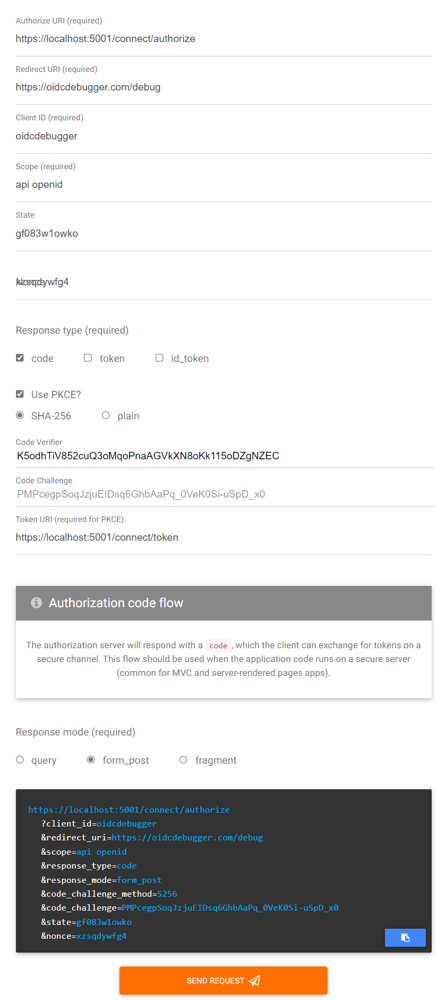
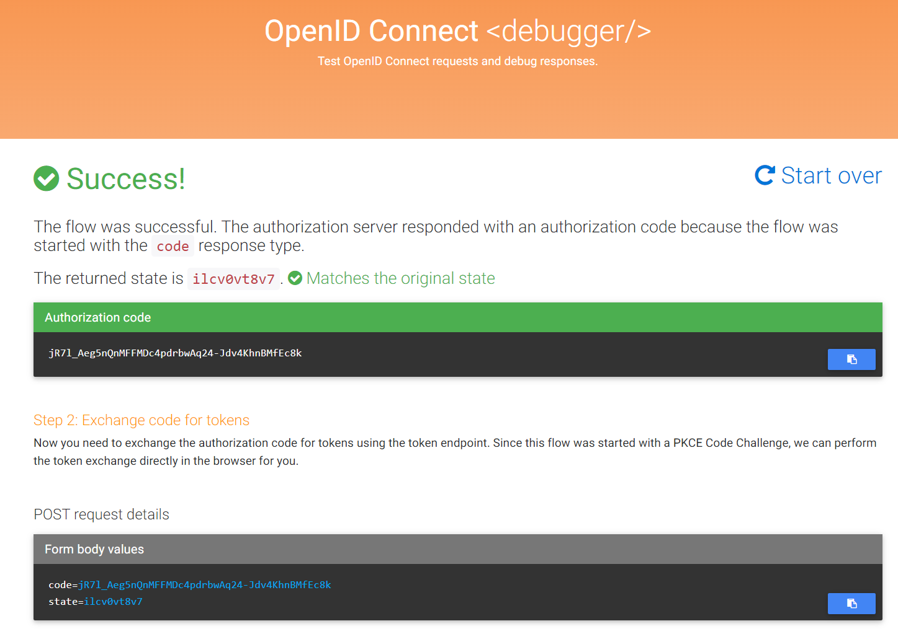

# OpenID Connect debugger

Testing the 'OpenID Connect Server' using 'OpenID Connect debugger'

## Add another client

```cs
if (await manager.FindByClientIdAsync("oidcdebugger", cancellationToken) is null)
{
    await manager.CreateAsync(new OpenIddictApplicationDescriptor
    {
        ClientId = "oidcdebugger",
        ClientSecret = "oidcdebugger-secret",
        RedirectUris = { new Uri("https://oidcdebugger.com/debug") }, // for AuthorizationCodeFlow
        DisplayName = "OidcDebugger",
        Permissions =
    {
        OpenIddictConstants.Permissions.Endpoints.Authorization, // for AuthorizationCodeFlow
        OpenIddictConstants.Permissions.Endpoints.Token,

        OpenIddictConstants.Permissions.GrantTypes.AuthorizationCode, // for AuthorizationCodeFlow
        OpenIddictConstants.Permissions.GrantTypes.ClientCredentials,

        OpenIddictConstants.Permissions.GrantTypes.RefreshToken, // for Refresh Token

        OpenIddictConstants.Permissions.Prefixes.Scope + "api",

        OpenIddictConstants.Permissions.ResponseTypes.Code // for AuthorizationCodeFlow
    }
    }, cancellationToken);
}
```

## Run Debugger

Open <https://oidcdebugger.com/>




